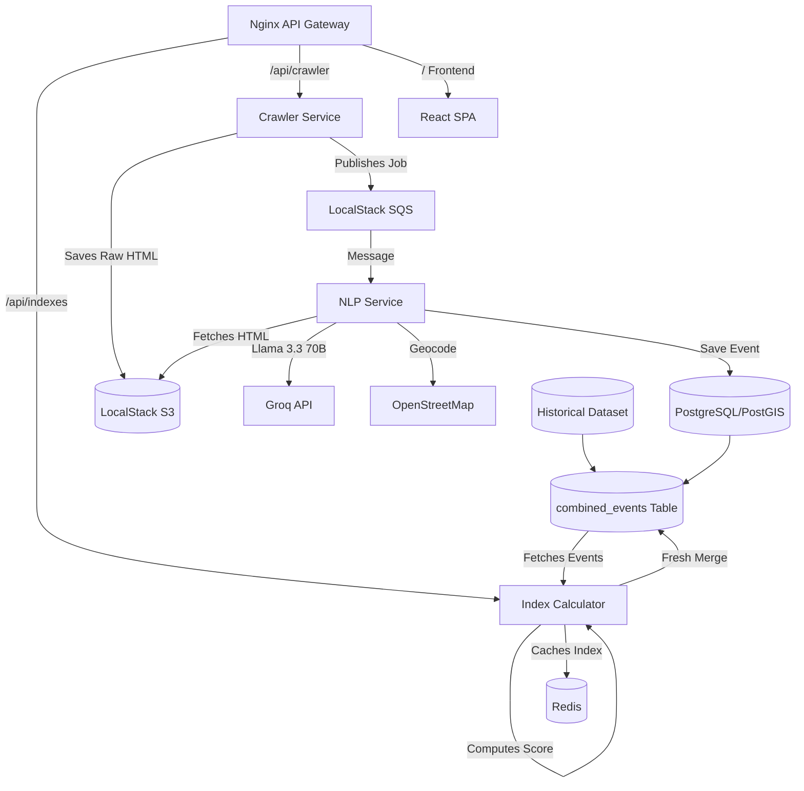

# 🏙️ Dhaka Real-Time Crime Index — Project Context

Welcome to the **Dhaka Crime Index** project. This system is designed to scrape, analyze, and visualize crime data across Dhaka, Bangladesh, providing a real-time "safety score" for different neighborhoods.

## 🚀 System Overview

The project follows a microservices architecture, leveraging LLMs (Groq) for extraction and a spatially-aware database (PostGIS) for storage.

## 🛠️ Service Breakdown

| Service | Responsibility | Key Tech |
| :--- | :--- | :--- |
| **Crawler** | Scrapes news from *The Daily Star*. | BeautifulSoup, boto3, apscheduler |
| **NLP** | Analyzes article bodies, extracts facts, and geocodes. | Llama 3.3 (Groq), Nominatim |
| **Index Calculator** | Aggregates crime data into neighborhood scores via **Robust Combined Table**. | SQLAlchemy, Redis, APScheduler |
| **Frontend** | Visualizes live and cumulative crime indexes on an interactive map. | React, Vite, Leaflet.js |
| **Infrastructure** | Unified environment for LocalStack, Postgres, Redis. | Docker Compose, PostGIS, Nginx |

## 📊 Dual Index Methodology

The system calculates two distinct safety metrics:

1.  **30-Day Index (Recent Risk)**: Focuses exclusively on "live" scraped events from the last 30 days. Uses exponential decay to prioritize very recent news.
2.  **Cumulative Index (Historical Pattern)**: Merges all "live" events with the **Bangladesh Crime Dataset (1100+ entries)**.
    - **Adaptive Normalization**: Divisor scales with event volume (`max(200, n*10)`) to prevent high-volume areas from hitting a hard 100 cap.
    - **Historical Base Weight**: Historical events use a fixed recency weight of **0.1** to ensure they contribute to the all-time risk without inflating recent indicators.

## 🗺️ Project Context Map

| Component | Responsibility | Ports | Key Dependencies | Storage / Data |
| :--- | :--- | :--- | :--- | :--- |
| **Crawler** | News fetching | 8080 (int) | localstack (s3, sqs) | S3 (HTML), SQS (Jobs) |
| **NLP** | Fact extraction | 8000 (int) | groq (API), postgis (db) | PostgreSQL (`crime_events`) |
| **Index Calc** | Scores & Table Sync| 8003 (int) | postgres, redis | `combined_events`, Redis |
| **Frontend** | UI & Visualization | 80 (ext)  | nginx, index API | Static Assets |
| **Database** | Spatial Storage | 5432 (ext) | postgis extension | `combined_events`, `dataset` |

## 🧠 Data Integrity & Deduplication

- **Fresh Merge Architecture**: The `combined_events` table is physically re-populated during every recalculation to sync live data and historical archives.
- **Compound Name Preservation**: Areas like **"Dhaka University"** and **"Old Dhaka"** are tracked as exact string literals to prevent collision with broader labels like **"Dhaka"**.
- **Case Normalization**: All area names are `LOWER(TRIM())` at the database level to eliminate duplicates from mixed-case source data.

## ⚠️ Risk Assessment

- **Public API Dependency**: Reliance on Groq Cloud and Nominatim (OSM) for critical path processing.
- **Data Freshness**: Index scores decay over time; persistent scraping downtime leads to score irrelevance.
- **Formula Scaling**: As dataset volume grows, the adaptive normalization scalar (currently 10.0) may need periodic tuning to maintain score sensitivity.

---
*Last Updated: 2026-03-13 — Robust Combined Table Refresh*
